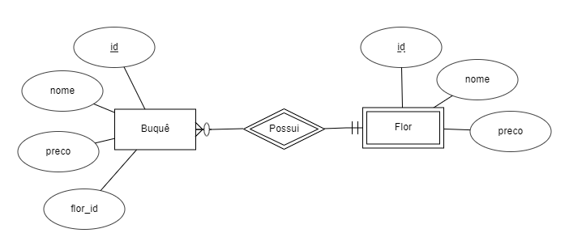

# confs-mysql
Nessa pasta estão os arquivos relacionados ao banco de dados do projeto, que está sendo salvo na máquina **ics-database**, nosso servidor de banco de dados para a atividade.

## Funcionamento
Aqui temos o diagrama ER mais recente, que iremos atualizando conforme o necessário.

Temos também os arquivos contendo os códigos SQL usados para criação das tabelas do projeto.
